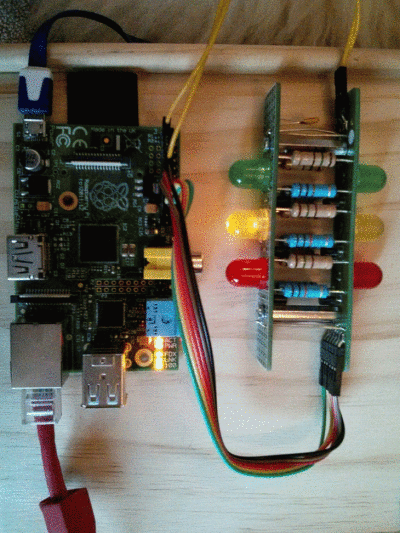
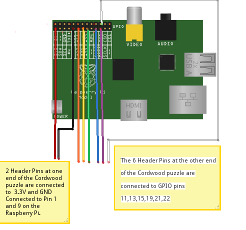

cordwoodpuzzle-raspberrypi
==========================

Use Boldport's Cordwood puzzle with the GPIO pins on a Raspberry Pi.

I failed to photograph the 2nd green LED lit - but it does!:

Do not use with 5V as the GPIO pins are unprotected. Switch off the Raspberry Pi to prevent damage to the pins while connecting.
Pin reference: http://www.raspberrypi-spy.co.uk/2012/06/simple-guide-to-the-rpi-gpio-header-and-pins/
Connect 3.3V and GND (e.g. Pins 1 and 9) to the 2 pin header above the boldport name. Check that all 6 LEDS light when you power up the Pi. 
Switch off the Raspberry Pi to prevent damage to the pins while connecting.

Connect Raspberry Pi GPIO pins 11,13,15,19,21,22 to the 6 header pins at the other end of the puzzle. You did remember to solder all 6 of the connector pins up?

Download the script and run it:

    $ sudo python ./puzzle.py

tng 1-May-2014
